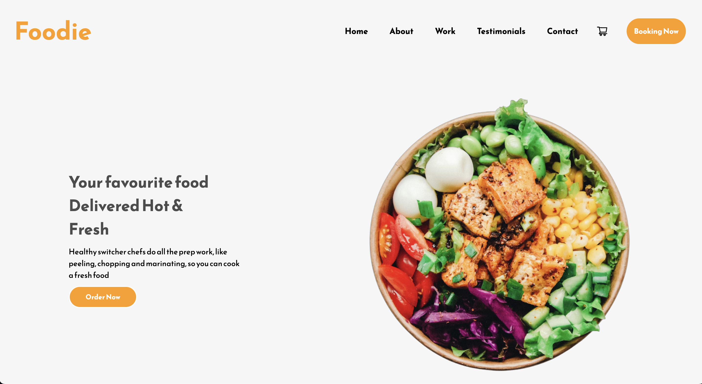
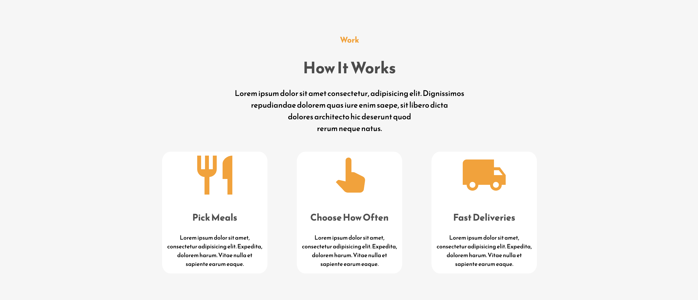
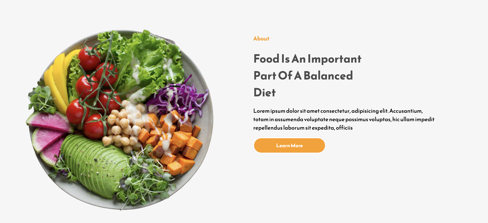
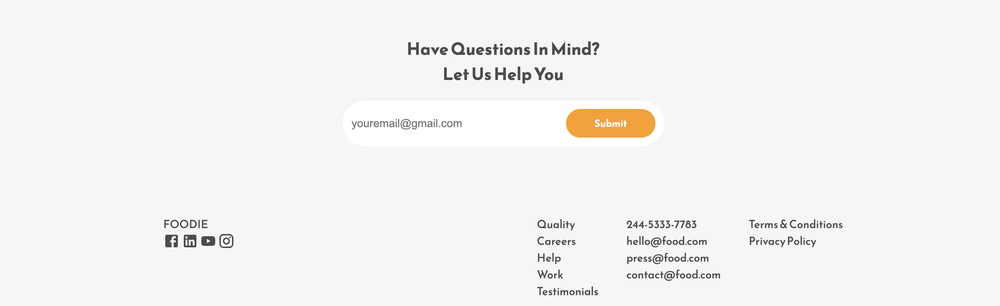

# Restaurant Landing Page

Welcome to our restaurant landing page project! This project is a single-page application built with React.js to showcase our restaurant's menu, services, and contact information. It provides a delightful user experience for customers interested in learning more about our restaurant.

## Table of Contents

- [Description](#description)
- [Installation](#installation)
- [Usage](#usage)
- [Features](#features)
- [Snapshots](#snapshots)

## Description

Our restaurant landing page is a visually appealing and interactive website designed to attract customers and provide essential information about our restaurant. Visitors can explore our menu, learn about our chefs, read customer testimonials, view our gallery, and easily get in touch with us.

## Installation

To run the project locally, follow these steps:

1. Clone the repository to your local machine:

   ``` git clone https://github.com/Jasleenkaur1998/Restaurant-App.git```

1. Navigate to the project directory:

   ```cd restaurant-landing-page```

2. Install dependencies:
```npm install```
3. Start the development server:
```npm start```

## Usage

Once the installation is complete and the development server is running, open your browser and visit `http://localhost:3000` to view the restaurant landing page. Explore the various sections to learn about our menu, chefs, customer testimonials, and more.

## Features

- **Menu:** Browse our delicious menu items with detailed descriptions.
- **Work Section:** Showcasing our talented work and learn from culinary expertise.
- **Testimonials:** Read what our happy customers have to say about their dining experience.
- **Contact:** Easily get in touch with us using the contact form or find our location on the map.

## Snapshots:



